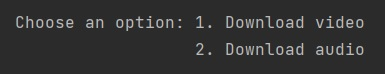

# Youtube Downloader

## <i>Description</i>

This script is designed to download the video file or the audio file using the link of an Youtube song.

## <i>Prerequisites</i>
### Modules used 
| Name module    | Description                      |
|----------------|----------------------------------|
| <center>os     | <center>Builtin module           |
| <center>pytube | <center>```pip install pytube``` |

## Informations

[Pytube documentation](https://pytube.io/en/latest/)

## Running steps

- Copy the link of an Youtube video
- Run the program and paste the link when it is asked<br>
```Enter the URL:```
- It will display informations about your video such as Title, Number of views, Length of video and Ratings
- Select the option which you want between
  <br>
  
  <br>
1. Download the video (.mp4)
<br>
2. Audio (.mp3)
- The program will let you know when the file is downloading and also when the file is downloaded successfully
- In the project folder will be displayed the filed downloaded